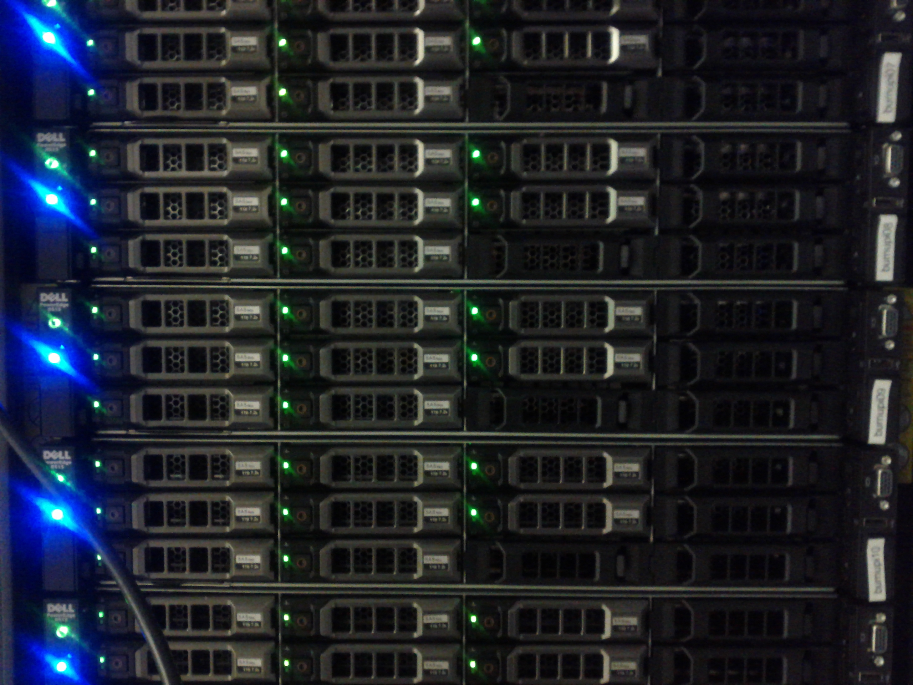
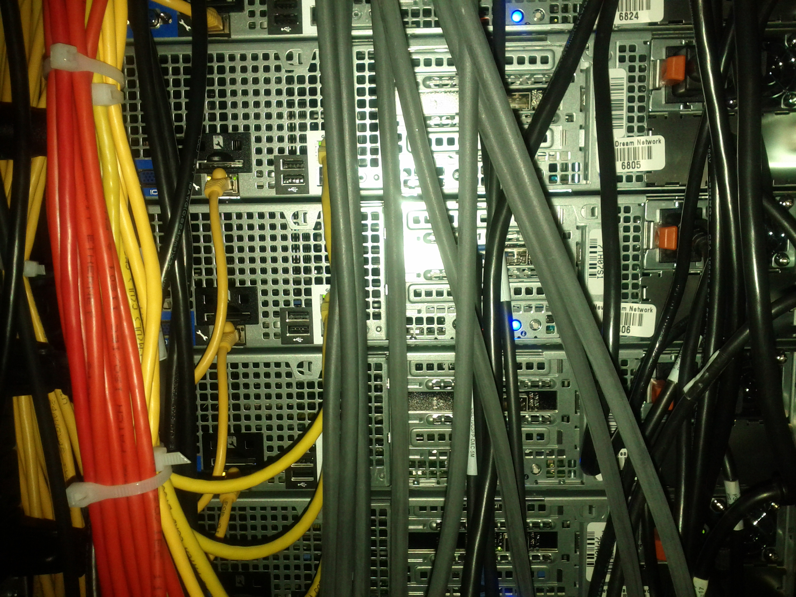

=========
 Burnupi
=========

.. raw:: html

   

   Front of a burnupi server.

   .. table::
      :class: hardware-diagram

      +---------+---------+-----------+------------+--------+
      | HDD 1TB | HDD 1TB | HDD 1TB   | HDD unused | Serial |
      +---------+---------+-----------+------------+--------+
      | HDD 1TB | HDD 1TB | HDD 1TB   | HDD unused | 1xUSB  |
      +---------+---------+-----------+------------+--------+
      | HDD 1TB | HDD 1TB | HD unused | HDD unused |        |
      +---------+---------+-----------+------------+--------+

   Back of a burnupi server.

   .. table::
      :class: hardware-diagram

      +--------------------------------------------+--------------------------------------------+
      |                                            | PCI 1: unused                              |
      |                                            |                                            |
      +--------------+----------+-------+----------+--------------------------------------------+
      |              | DRAC     |       | NIC 1g1  | PCI 2: NIC, A 10g1 (back), B 10g2 (unused) |
      |              | SD-card  |       | (front)  |                                            |
      +--------+-----+----------+-------+----------+--------------------------------------------+
      |        |     | DRAC     |       | NIC 1g2  | PCI 3: unused                              |
      | Serial | VGA | ethernet | 2xUSB | (unused) |                                            |
      +--------+-----+----------+-------+----------+--------------------------------------------+
