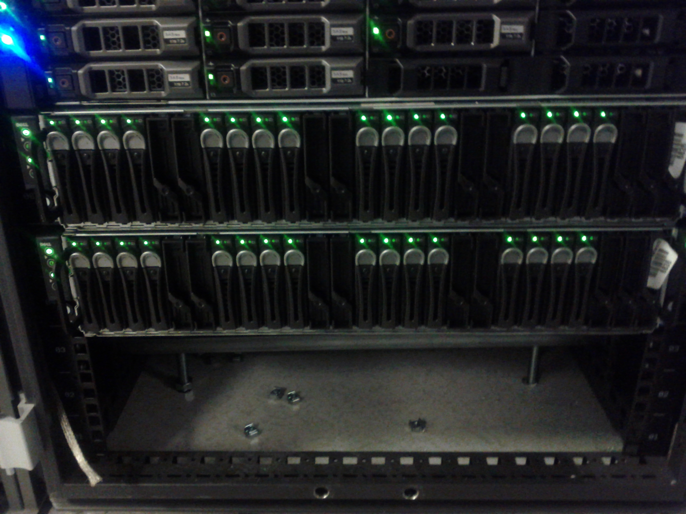

=========
 Servers
=========

.. raw:: html

   

.. figure:: overview.jpg
   :width: 40%

   Front view of the row hosting `Sepia`.

Plana
=====

   Front of a plana server.

   Back of a plana server.

   .. table::
      :class: hardware-diagram

      +--------------+----------+-------+----------+--------------------------------------------+
      |              | DRAC     |       | NIC 1g1  | PCI: NIC, A 10g1 (back), B 10g2 (unused)   |
      |              | SD-card  |       | (front)  |                                            |
      +--------+-----+----------+-------+----------+--------------------------------------------+
      |        |     | DRAC     |       | NIC 1g2  |                                            |
      | Serial | VGA | ethernet | 2xUSB | (unused) |                                            |
      +--------+-----+----------+-------+----------+--------------------------------------------+

Burnupi
=======

   Front of a burnupi server.

   Back of a burnupi server.

   .. table::
      :class: hardware-diagram

      +--------------------------------------------+--------------------------------------------+
      |                                            | PCI 1: unused                              |
      |                                            |                                            |
      +--------------+----------+-------+----------+--------------------------------------------+
      |              | DRAC     |       | NIC 1g1  | PCI 2: NIC, A 10g1 (back), B 10g2 (unused) |
      |              | SD-card  |       | (front)  |                                            |
      +--------+-----+----------+-------+----------+--------------------------------------------+
      |        |     | DRAC     |       | NIC 1g2  | PCI 3: unused                              |
      | Serial | VGA | ethernet | 2xUSB | (unused) |                                            |
      +--------+-----+----------+-------+----------+--------------------------------------------+

Vercoi
=======

   Front of a vercoi server.

.. figure:: vercoi-back.jpg
   :width: 70%

   Back of a vercoi server.

   .. table::
      :class: hardware-diagram

      +--------------------------------------+--------------+
      | PCI: NIC, 10g1 (back), 10g2 (unused) | PCI? unused  |
      +-------+--------+--------+------------+--------+-----+
      |       | NIC 1g | NIC 1g | DRAC       |        |     |
      | 2xUSB | (?)    | (?)    | ethernet   | Serial | VGA |
      +-------+--------+--------+------------+--------+-----+

