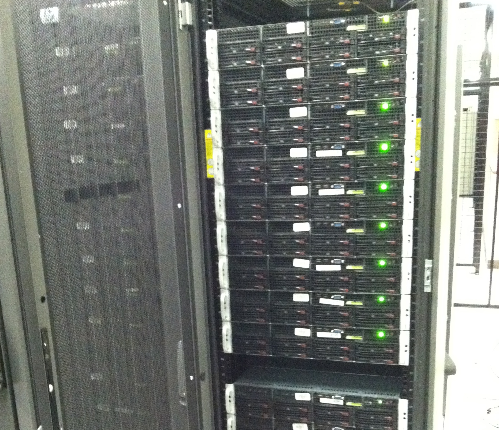
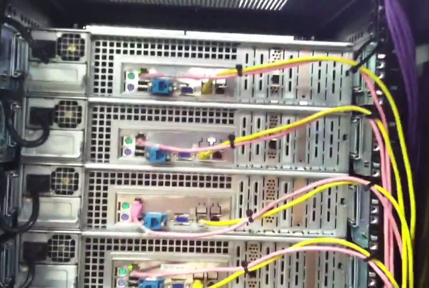

=========
 Mira
=========

.. raw:: html

   

   Front of a mira server.

   .. table::
      :class: hardware-diagram

      +---------+---------+---------+---------+
      | HDD 1TB | HDD 1TB | HDD 1TB | HDD 1TB |
      +---------+---------+---------+---------+
      | HDD 1TB | HDD 1TB | HDD 1TB | HDD 1TB |
      +---------+---------+----------+--------+

   Back of a mira server.

   .. table::
      :class: hardware-diagram

      +-----------------------------------------------+-----------------------------------------+
      |                                               | PCI-E slots 1-7 (half height)           |
      |                                               |                                         |
      +--------+------+-------------------------------+                                         |
      |        |      |                               |                                         |
      | ps/2   | IPMI |                               |                                         |
      +--------+------+----------+---------+----------+                                         |
      |        |      |          | NIC 1g1 | NIC 1g2  |                                         |
      | ps/2   | USB  | Serial   | (front) | (unused) |                                         |
      +--------+------+----------+---------+----------+-----------------------------------------+
