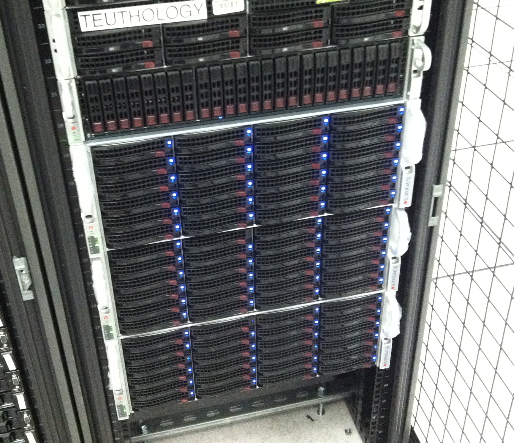

=========
 Misc Servers
=========

.. raw:: html

   

   Special mira-hardware machines:

   * **backup01** (For backups/apt-mirror)

   * **gitbuilder-archive** (Hosts gitbuilder.ceph.com)

   * **teuthology** (machine used for testing suite)

   .. table::
      :class: hardware-diagram

      +---------+---------+---------+---------+
      | HDD 1TB | HDD 1TB | HDD 1TB | HDD 1TB |
      +---------+---------+---------+---------+
      | HDD 1TB | HDD 1TB | HDD 1TB | HDD 1TB |
      +---------+---------+---------+---------+

   ARM machines:

   Top (**tala001-024**):

   * 24 Nodes.

   * 1x500GB per node.

   .. table::
      :class: hardware-diagram

      +----+----+----+----+----+----+----+----+----+----+----+----+----+----+----+----+----+----+----+----+----+----+----+----+----+
      |    |    |    |    |    |    |    |    |    |    |    |    |    |    |    |    |    |    |    |    |    |    |    |    |    |
      |    |    |    |    |    |    |    |    |    |    |    |    |    |    |    |    |    |    |    |    |    |    |    |    |    |
      |500G|500G|500G|500G|500G|500G|500G|500G|500G|500G|500G|500G|500G|500G|500G|500G|500G|500G|500G|500G|500G|500G|500G|500G|500G|
      |HD  |HD  |HD  |HD  |HD  |HD  |HD  |HD  |HD  |HD  |HD  |HD  |HD  |HD  |HD  |HD  |HD  |HD  |HD  |HD  |HD  |HD  |HD  |HD  |HD  |
      +----+----+----+----+----+----+----+----+----+----+----+----+----+----+----+----+----+----+----+----+----+----+----+----+----+

   Rear:

   .. table::
      :class: hardware-diagram

      +------+------------------------------------------------------------+
      |      |                                                            |
      | PSU1 |                                                            |
      +------+------+------+------+------+------+-------------------------+
      |      |      |      |      |      |      |                         |
      | PSU2 |      | SFP3 | SFP2 | SFP1 | SFP0 |  PCI-E slots            |
      +------+------+------+------+------+------+-------------------------+

   Bottom 3x4u (top to bottom: **saya001-012**, **saya0013-024**, **saya025-036**)
   Each chassis: 

   * 12 nodes

   * 4x3TB per node

   * Every 4th node diskless

   Front:

   .. table::
      :class: hardware-diagram

      +------+------+------+------+
      | 3TB  | 3TB  | 3TB  | 3TB  |
      | HD   | HD   | HD   | HD   |
      +------+------+------+------+
      | 3TB  | 3TB  | 3TB  | 3TB  |
      | HD   | HD   | HD   | HD   |
      +------+------+------+------+
      | 3TB  | 3TB  | 3TB  | 3TB  |
      | HD   | HD   | HD   | HD   |
      +------+------+------+------+
      | 3TB  | 3TB  | 3TB  | 3TB  |
      | HD   | HD   | HD   | HD   |
      +------+------+------+------+
      | 3TB  | 3TB  | 3TB  | 3TB  |
      | HD   | HD   | HD   | HD   |
      +------+------+------+------+
      | 3TB  | 3TB  | 3TB  | 3TB  |
      | HD   | HD   | HD   | HD   |
      +------+------+------+------+

   Rear:

   .. table::
      :class: hardware-diagram

      +----+--------------------------------------+
      |    |                                      |
      |PSU1|                                      |
      +----+-----+------+------+------+------+----+
      |PSU2|     |      |      |      |      |    |
      |    |     | SFP3 | SFP2 | SFP1 | SFP0 | PCI|
      +----+-----+------+---+--+------++-----+----+
      |          |          |          |          |
      | 3TB HD   | 3TB HD   | 3TB HD   | 3TB HD   |
      +----------+----------+----------+----------+
      |          |          |          |          |
      | 3TB HD   | 3TB HD   | 3TB HD   | 3TB HD   |
      +----------+----------+----------+----------+
      |          |          |          |          |
      | 3TB HD   | 3TB HD   | 3TB HD   | 3TB HD   |
      +----------+----------+----------+----------+

