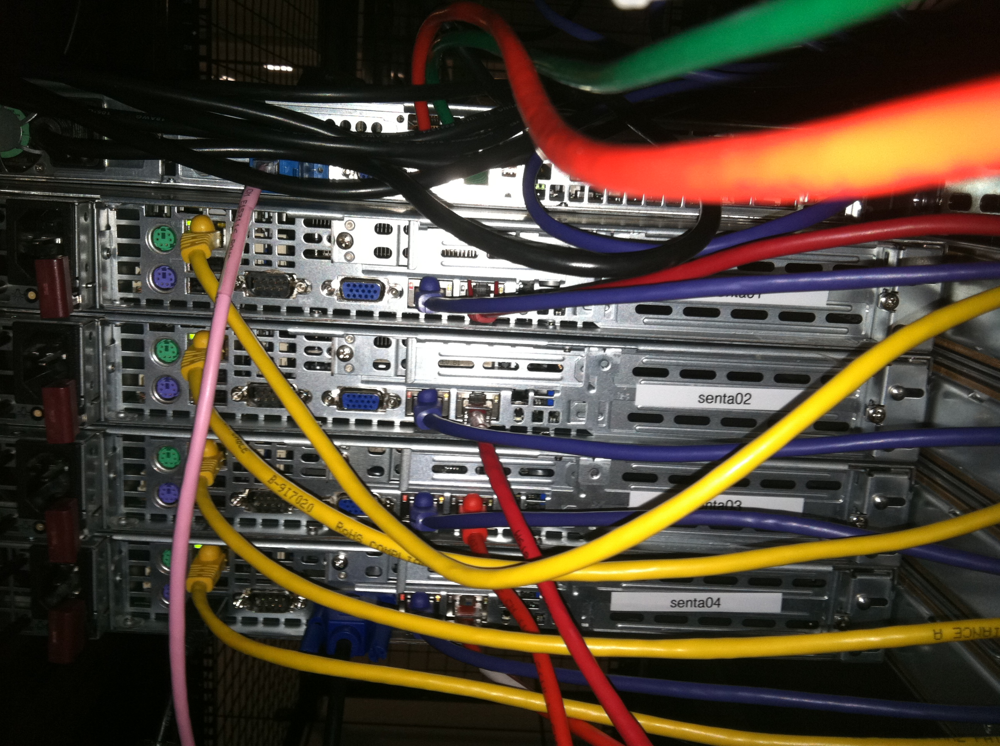

=========
Senta
=========

* 1u Supermicro
* 12 core/24 thread
* 72G RAM
* 4x500GB MDADM
* VM hosts

.. raw:: html

   

.. figure:: senta-front.jpg
   :width: 70%

   Front of a senta server.

   .. table::
      :class: hardware-diagram

      +---------+---------+-----------+------------+
      |         | dvd-rom |           |            |
      +---------+---------+-----------+------------+
      | HDD 1TB | HDD 1TB | HDD 1TB   | HDD 1TB    |
      +---------+---------+-----------+------------+

   Back of a senta server.

   .. table::
      :class: hardware-diagram

      +--------+-------+--------+-------+----------+--------------------------------------------+
      |        |       |                                                                        |
      | PS/2   | IPMI  |                                                                        |
      +--------+-------+--------+-------+----------+----------+---------------------------------+
      |        |       |        |       | NIC 1g1  | NIC 1g2  | PCI 1: unused                   |
      | PS/2   | 2xUSB | Serial | VGA   | (front)  | (Others) |                                 |
      +--------+-------+--------+-------+----------+----------+---------------------------------+

Networking inside the Linux host:

.. graphviz:: senta-interfaces.dot

